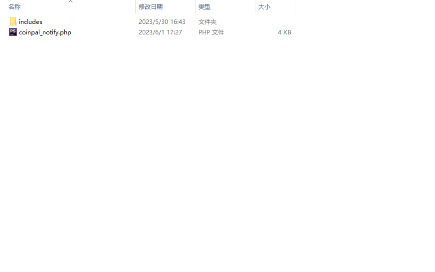
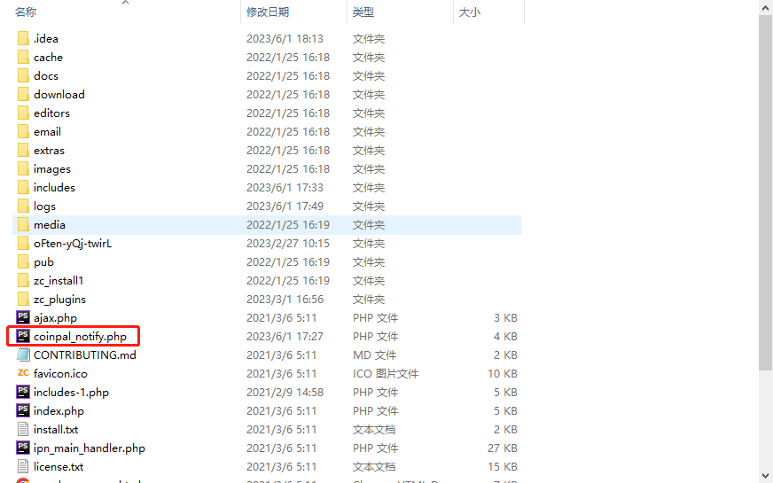
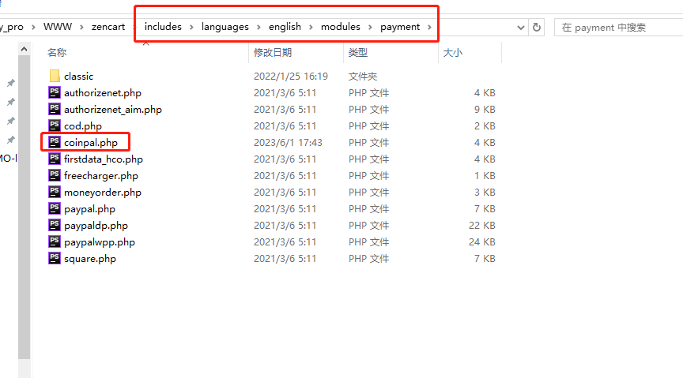
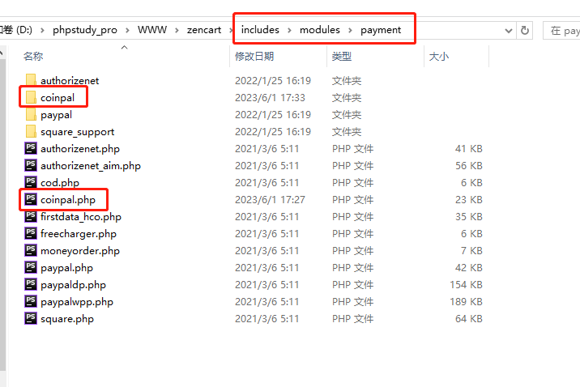
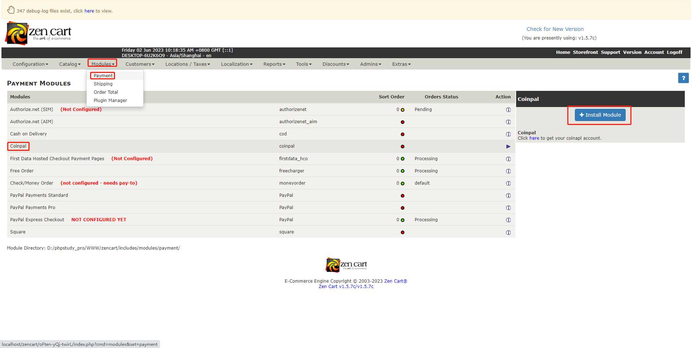
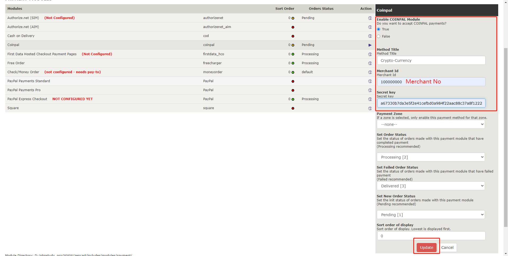
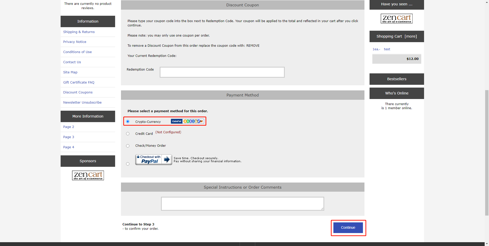
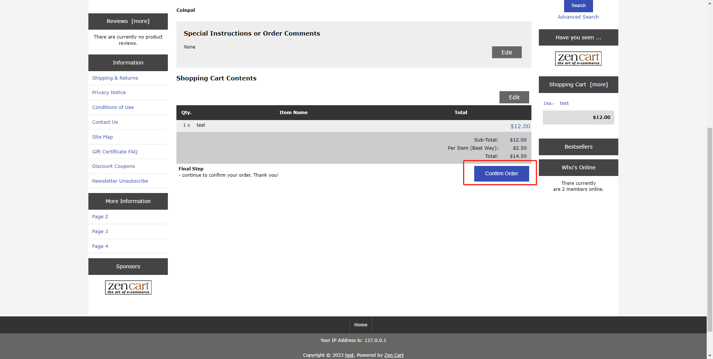

# ZenCart Coinpal Checkout Installation

## Step 1: Login Coinpal Admin Dashboard get Merchant No and Secret Key.
1. [Register](https://portal.coinpal.io/#/admin/register)/[login](https://portal.coinpal.io/#/admin/login) and go to Coinpal's Admin Dashboard 

2. Follow the Dashboard guidelines to fill in the relevant information

3. Click the 'Integration' button in the lower left corner to get the corresponding Merchant Id and Secret Key

## Step 2: Installing the Coinpal Plugin on your ZenCart Site.
1. Click the  [Coinpal plug](https://github.com/CoinpalGroup/plug_ZenCart/blob/master/coinpal.zip)  Download Coinpal ZenCart Payment Plug
2. Unzip the coinpal.zip file and enter the coinpal folder

3.  Copy the coinpal_notify.php file to the root directory of the ZenCart project

4. Copy the includes\languages\english\modules\payment\coinpal.php file to the ZenCart project includes\languages\english\modules\payment

5. Copy all files in includes\modules\payment to ZenCart project includes\modules\payment

3. Activate the Coinpal ZenCart Gateway

    Go to your ZenCart admin area and click on Modules -> Payment

    Find the payment method Coinpal, click Install Module

Copy and Paste all of the Settings you generated in your Coinpal Dashboard on Step #1.

Click Update Changes.

## Step 3: Testing your Coinpal WooCommerce Integration.

To confirm your Integration is properly working create a test order:

Add Test Item to Shopping Cart and View Cart.

Proceed to Checkout

Select Pay Crpto with Coinpal as the Payment Method.

Click Continue button

Click Confirm Order button

If you like you can now proceed to making a test payment.

## Step 4: Marking a Payment as Received on ZenCart.

Login to your ZenCart Admin Dashboard.

Go to the ZenCart Section and Click Orders.

You will see the Test Orders Marked as “Paid”

Verify the Coins are in your chosen Coinpal Wallet (The addresses you input in Step #1.)

You may also use a Block Explorer to verify if the transaction was processed.

After the verification of the above steps is completed, it means that the connection with Coinpal is successful.

